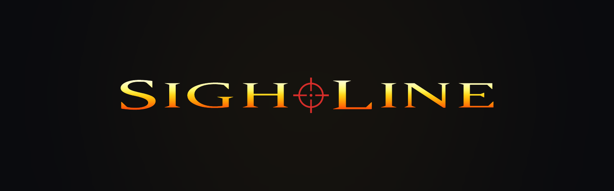

<p align="center">
  <a href="#sightline"></a>
</p>

<p align="center">
  <strong>A modernized, natively-compiled engine fork of the GoldenEye 007 N64 decompilation — the full game, no emulator.</strong>
</p>

<p align="center">
  <a href="#play-a-release-windows">Play</a> ·
  <a href="#windows-quick-start">Build</a> ·
  <a href="#current-status">Status</a> ·
  <a href="docs/ROADMAP.md">Roadmap</a> ·
  <a href="https://github.com/mscrnt/Sightline/wiki">Wiki</a> ·
  <a href="https://github.com/users/mscrnt/projects/7">Project board</a> ·
  <a href="#licensing">Licensing</a>
</p>

---

## Sightline

**Sightline** is a modernized, natively-compiled engine fork of the
[GoldenEye 007 N64 decompilation](https://gitlab.com/kholdfuzion/goldeneye_src),
covering the **full game** — all campaign levels, all multiplayer maps. The
game code runs as a native Windows executable against a thin platform layer
and an OpenGL renderer; no emulator, no RCP simulation.

This repository **is** a fork of the decomp, not a wrapper around it. The
original matching build is kept permanently buildable as the correctness
oracle, and the upstream project remains the shared vocabulary for symbols,
formats, and structure. See [Credits](#credits-and-acknowledgements).

## Goals

Three deliverables, in dependency order — these are **goals**, not shipped
features:

1. **Smarter AI** — squad communication and an alarm information graph:
   guards know only what has been communicated to them. Behavior archetypes
   ported *by design* from Perfect Dark (a behavioural reference, never a
   code dependency).
2. **Real lighting** — clustered forward rendering with shadow-casting
   dynamic lights, retaining the original vertex colors as baked indirect
   light.
3. **NIGHTWATCH** — an asymmetric online mode: 1 infiltrator versus up to 7
   human guards, across the campaign.

One rule shapes everything: **nothing is hand-authored per level.** Twenty-plus
levels means any manual per-level step becomes the critical path, so lights,
spawns, guard tables and the rest are derived by tooling from existing level
data, with small override files for corrections.

The phase structure and gates live in [docs/ROADMAP.md](docs/ROADMAP.md).

## Current status

Honestly, and in one place:

- The **native Windows build** boots the retail game data through the
  cartridge's own front end and plays the full single-player campaign.
  **v0.2.0 (QoL Phase 1)** adds semantic keyboard / mouse / controller
  controls with persistent remapping, native settings pages, widescreen
  aspect ratios, FOV, resolution and window modes, and an in-game QUIT GAME;
  see [Releases](#releases).
- The **determinism gate** is green: all 20 campaign levels replay
  byte-identically across 10 consecutive runs of the trace harness.
- **Phase 1** (excising the RCP / severing `src/game` from libultra) is
  open. A parallel AI track runs against the matching build.

## The correctness spine

Two artifacts keep the port honest:

- The **matching build** — the original decomp compiled to byte-identical
  MIPS. It is the oracle, and it stays buildable permanently.
- The **trace harness** — recorded input streams plus per-tick state hashes.
  Any change touching game logic must replay the corpus unchanged
  (`make trace-verify`); intentional divergences are documented in
  [docs/divergences.md](docs/divergences.md) and re-baselined explicitly.

When the native build and the cartridge disagree, the cartridge is right.
Original behavior — including Rare's bugs — is preserved by default;
intentional changes sit behind runtime toggles defaulting to original
behavior.

## Play a release (Windows)

The quickest way to play is a release package: no toolchain, no clone.

1. Open the [Releases](https://github.com/mscrnt/Sightline/releases) page and
   download the latest `Sightline-vX.Y.Z-win32.zip` (and, to verify it, the
   `.sha256` file beside it).
2. Extract the whole ZIP to a folder of your choice.
3. Copy your **own** compatible GoldenEye 007 (USA) `.z64` dump into that
   folder, beside `Sightline.cmd` (or point `SL_ROM` at it). The package
   contains no ROM and no game data - everything the game draws, plays and
   loads is read from your ROM at run time. The supported dump and its
   checksum are under [Assets and legal posture](#assets-and-legal-posture).
4. Double-click `Sightline.cmd`.

`README.txt` inside the package covers the ROM requirement, where the save is
written (`%LOCALAPPDATA%\sightline`) and how to verify the download.

### Releases

- **v0.2.0 - QoL Phase 1.** The first release with a downloadable Windows
  binary (`Sightline-v0.2.0-win32.zip`). Notes:
  [docs/releases/v0.2.0.md](docs/releases/v0.2.0.md).
- **v0.1.0 - the pre-QoL native source checkpoint.** Source-only: no Windows
  binary is attached, because that revision compiled a small ROM-derived
  audio table into its executable and Sightline does not distribute
  ROM-derived data. Notes: [docs/releases/v0.1.0.md](docs/releases/v0.1.0.md).

## Windows quick start

This is the developer path: building the game from source. Sightline does
not include a GoldenEye ROM. You need your own compatible GoldenEye 007 (U)
ROM dump; the supported dump and its checksum are listed under
[Assets and legal posture](#assets-and-legal-posture).

### 1. Clone the repository

```powershell
git clone <repository-url>
cd sightline
```

### 2. Supply your ROM

Sightline reads a plain, uncompressed, big-endian `.z64` dump of GoldenEye
007 (USA). Either place it at `baserom.u.z64` in the repository root, or
point `SL_ROM` at it:

```powershell
$env:SL_ROM = "D:\Games\GoldenEye\baserom.u.z64"
```

Both locations are ignored by Git; the ROM must never be committed.

If your dump came as an archive, e.g. `007 - GoldenEye (USA).zip`:

- Extract it first (right-click → Extract All, or `Expand-Archive`).
  Sightline does not read archives.
- The extracted file is typically `007 - GoldenEye (USA).z64`. Either
  copy it to `<repo>\baserom.u.z64`, or leave it where it is and set
  `$env:SL_ROM` to its full path (no rename is needed with `SL_ROM`).
- Windows Explorer hides known extensions by default, so a rename can
  silently produce `baserom.u.z64.z64`. Check with `Get-ChildItem` /
  `dir` in PowerShell, which shows the real name.
- If the extracted file is `.n64` or `.v64`, it is byte-swapped; convert
  it to a big-endian `.z64` with a ROM tool (or re-dump) before use. The
  native launcher does not detect this and will not run correctly.

Self-check in PowerShell (the native launcher does not verify the file
for you):

```powershell
(Get-Item .\baserom.u.z64).Length                    # 12582912
(Get-FileHash .\baserom.u.z64 -Algorithm SHA1).Hash  # ABE01E4AEB033B6C0836819F549C791B26CFDE83
```

Size and hash must both match; a wrong hash with the right size usually
means a byte-swapped or modified dump. (`make verify-rom` performs the
same checks with more detailed diagnostics for the matching build.)

### 3. Set up the Windows toolchain

Run `.\tools\windows\setup.ps1` to diagnose what is present, then
`.\tools\windows\setup.ps1 -Install` to install the missing MSYS2 mingw32
packages (SDL2, compiler toolchain, Python venv).

### 4. Build

`.\tools\windows\build.ps1` produces `build\win32\sightline.exe`. The build
itself needs no ROM and no output of the matching build: the ROM is read at
run time (the audio microcode's tables included - nothing ROM-derived is
generated or compiled in), and the link-map input the build places symbols
from is the tracked `tools\native\ge007.u.linkmap.txt`.

### 5. Run

`.\tools\windows\play.ps1` boots to the game's own front end (and runs
`build.ps1` first if the executable is missing). For a direct boot into a
level:

```powershell
.\tools\windows\play.ps1 -Level dam -Difficulty 2
```

Mouse and keyboard work out of the box; `play.ps1` prints the controls.

### 6. Optional smoke test

`.\tools\windows\test.ps1` runs the headless Facility acceptance and
reports the result through its exit code.

### Beyond the quick start

`tools\windows\package-demo.ps1` bundles a build with a ROM you supply into
a single private, local executable; that output is git-ignored and is not
something this repository ships. `tools\windows\README.md` covers the
launcher and measurement modes in more detail.

The matching build and the trace tooling are driven through `make`
(`make matching`, `make sightline`, `make trace-verify`); see
[docs/SetupGuide.md](docs/SetupGuide.md) and
[docs/toolchain.md](docs/toolchain.md).

## Assets and legal posture

**No game assets live in this repository, ever.** No textures, audio,
models, level data, or anything derived from them — including AI-upscaled
textures. Assets are extracted at runtime from the user's own legally
obtained ROM, and nothing ROM-derived is committed or distributed.

The repository does contain **original artwork authored for Sightline**:
the replacement boot-screen models under
[data/asset-overrides/](data/asset-overrides/). Each embedded texture
declares its provenance in the source glTF, and the import tooling refuses
any embedded pixel that is not so declared — "no ROM-derived assets" and
"no artwork of our own" are different rules, and only the first applies.
See [docs/asset-overrides.md](docs/asset-overrides.md). The project's own
identity artwork (wordmark, mark, icon) lives under
[docs/brand/](docs/brand/) and is likewise built from authored geometry,
not from anything read out of the ROM.

The supported dump is NTSC-U:
`ge007.u.z64` — `sha1: abe01e4aeb033b6c0836819f549c791b26cfde83`.
The matching build also targets the JP and PAL dumps upstream supports
(`2a5dade32f7fad6c73c659d2026994632c1b3174`,
`167c3c433dec1f1eb921736f7d53fac8cb45ee31`).

GoldenEye 007 is the property of its rightsholders. This project is
unaffiliated with Rare, Nintendo, MGM, or Danjaq. Sightline distributes
no ROM or ROM-derived game assets; original Sightline-authored artwork
is included, while inherited source and third-party material retain
their existing copyright and licensing status.

## Licensing

Original code authored specifically for Sightline is released under the
Zero-Clause BSD license
([LICENSES/Sightline-Code-0BSD.txt](LICENSES/Sightline-Code-0BSD.txt)).
Documentation authored for Sightline is covered by the same grant. Original
artwork authored specifically for Sightline under
[data/asset-overrides/](data/asset-overrides/) is released under CC0 1.0
Universal
([LICENSES/Sightline-Assets-CC0-1.0.txt](LICENSES/Sightline-Assets-CC0-1.0.txt));
see [data/asset-overrides/LICENSE.md](data/asset-overrides/LICENSE.md).
Neither license requires attribution.

These licenses apply only to material owned by the Sightline project owner.
The GoldenEye decompilation source, the N64 SDK and toolchain material, and
other upstream or third-party content retain their own copyright and
licensing status; nothing in the Sightline licenses grants any rights to that
material. [LICENSES/README.md](LICENSES/README.md) lists what is and is not
covered. The brand artwork under [docs/brand/](docs/brand/) identifies the
project and is not offered for reuse; see
[docs/brand/README.md](docs/brand/README.md). The two controller models
under `data/asset-overrides/source/controllers/` are third-party CC-BY-4.0
work (see Credits below and their `ATTRIBUTION.md`), outside both Sightline
grants.

## Repository layout

```
src/game/             game logic - AI, physics, objectives (decomp code)
src/gfx/              gfx_ interface and GL backend (new)
src/platform/         thin platform layer - window, input, audio (new)
src/net/              replication, prediction, server (new)
src/libultra/         N64 SDK code, stubbed/severed during Phase 1
tools/trace/          determinism harness
tools/derive/         per-level derivers (lights, spawns, guard tables)
tools/windows/        Windows build and launch scripts
data/overrides/       small hand-tuned per-level corrections
data/asset-overrides/ original boot-screen models authored for Sightline
docs/                 roadmap, divergences, backlog, decisions
docs/brand/           project identity artwork (wordmark, mark, icon)
```

## Public mirror

The GitHub repository at https://github.com/mscrnt/Sightline is a
generated, read-only source mirror: each release of the private canonical
tree is exported, stripped of private infrastructure, and committed there
as a single publication commit. The private development history is not
published.

GitHub [Issues](https://github.com/mscrnt/Sightline/issues), the
[wiki](https://github.com/mscrnt/Sightline/wiki) and the
[project board](https://github.com/users/mscrnt/projects/7) are live: file
bug reports and questions as issues, follow development on the board, and
read the wiki for setup, controls and feature documentation. Pull requests
are not accepted — the mirror is a generated tree, so there is nothing for
a pull request to merge into.

## Credits and acknowledgements

- **The GoldenEye 007 decompilation project and its contributors** —
  [gitlab.com/kholdfuzion/goldeneye_src](https://gitlab.com/kholdfuzion/goldeneye_src).
  This repository is their work, forked; the game code, the matching build,
  and years of reverse engineering are the foundation everything here
  stands on. Decompilation status for the three supported ROMs is tracked
  at [kholdfuzion.github.io/goldeneyestatus](https://kholdfuzion.github.io/goldeneyestatus/).
- **Zoinkity's GoldenEye and Perfect Dark documentation** —
  [github.com/kholdfuzion/goldeneye_docs](https://github.com/kholdfuzion/goldeneye_docs).
  The authoritative reference for formats, layouts, and byte order
  throughout this project; consulted before the code, per project rule.
- **Rare** — for the original game.
- **Controller models** — the watch's Xbox and DualSense controllers are
  based on "Xbox Controller" by [umkhero](https://sketchfab.com/umkhero)
  ([source](https://sketchfab.com/3d-models/xbox-controller-32d17951703b4e05abed11a1c65f5909))
  and "Playstation 5 Dualsense" by
  [AHarmlessPotato](https://sketchfab.com/AHarmlessPotato)
  ([source](https://sketchfab.com/3d-models/playstation-5-dualsense-878c1f882808477ab81c2fe86d5a3936)),
  both licensed under [CC-BY-4.0](http://creativecommons.org/licenses/by/4.0/)
  and modified for Sightline; the changes and the full credit lines are in
  `data/asset-overrides/source/controllers/*/ATTRIBUTION.md`. No endorsement
  by the authors is implied.
